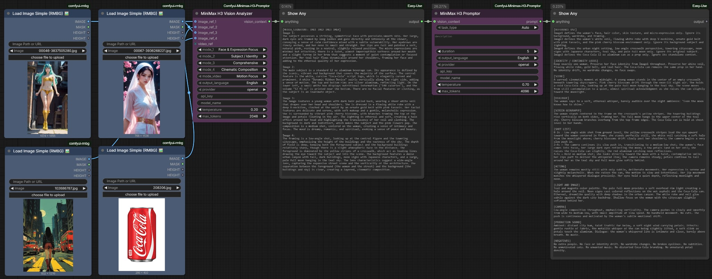

# 🎬 ComfyUI MiniMax H3 Direct Promptor (Enndee)

A single, unified ComfyUI node that generates **official-format MiniMax H3 prompts** directly from your reference images and text description — in one LLM call.

This is a personal, streamlined fork of the MiniMax H3-Promptor. It merges the old "Vision Analyzer + Promptor" two-node pipeline into a single **Direct Multimodal Promptor** node that feeds the reference images straight to a vision LLM, avoiding the information loss that occurs when images are first transcribed to text.



---

## ✨ What it does

The **MiniMax H3 Direct Promptor (Enndee)** node:

- Takes up to **8 reference images** (and an optional video) directly as `IMAGE` inputs.
- Sends them to a **vision-capable LLM** (OpenAI, Ollama, Gemini, or Claude) in a **single call**, together with the task type, the official H3 template documentation, and your creative description.
- Returns a **fully structured, official-format H3 prompt** using the correct `<Picture N>` / `<Subject N>` / `<Video N>` / `<Audio N>` labels, the three-field format (non-reference tasks) or six-section format (Ref2VA), speaker IDs `(S1)`, dialogue tags `<d>[Language] ...</d>`, and `[Shot N] At MM:SS.mmm` shot notation.

Because the LLM sees the actual pixels, it can correctly distinguish a **Picture** (a frame anchor) from a **Subject** (a character/object/scene), place characters inside the right location, and avoid showing a subject's cutout image as a frame.

---

## 🧩 Node Inputs

| Parameter | Type | Description |
|-----------|------|-------------|
| `task_type` | COMBO | Explicit task type: T2V, I2V, I2VA, V2V, V2VA, A2V, FL2VA, Ref2VA. (No "Auto" — choose explicitly.) |
| `description` | STRING | Your main creative description of the scene. |
| `duration` | INT | Desired video length (4–15 seconds). |
| `image_ref_1..8` | IMAGE | Up to 8 reference images. Mapped to `<Picture 1>` … `<Picture 8>` in order. |
| `video_ref` | IMAGE | Optional video reference (keyframes extracted). Mapped to `<Video 1>`. |
| `output_language` | COMBO | Output the prompt in `English` or `Chinese`. |
| `provider` | COMBO | `openai`, `ollama`, `gemini`, or `claude`. |
| `api_key` | STRING | API key override (leaves `config.json` untouched). |
| `model_name` | COMBO | Model to use. When Ollama is selected, this lists your registered Ollama models (like `ollama list`). |
| `temperature` | FLOAT | Sampling temperature. Default `0.6`. |
| `top_k` | INT | Ollama top-k sampling. Default `64` (0 = disabled). |
| `top_p` | FLOAT | Ollama top-p nucleus sampling. Default `0.9`. |
| `min_p` | FLOAT | Ollama min-p threshold. Default `0.05`. |
| `repeat_penalty` | FLOAT | Ollama repeat penalty. Default `1.1`. |
| `max_tokens` | INT | Maximum response tokens (256–16384). |

> The Ollama sampling parameters (`top_k`, `top_p`, `min_p`, `repeat_penalty`) are sent directly to Ollama on every call — no need to configure them in Ollama itself.

---

## 📏 Output limits

- **Hard 7,000-character limit** on the final prompt (MiniMax H3's official maximum). The system prompt instructs the LLM to stay under this, and the node's post-processor enforces it as a safety net.
- The `max_tokens` field is the **LLM's output budget** (the model that generates the prompt), not MiniMax H3's limit.

---

## 🔌 Supported LLM Providers

All 4 providers are implemented as **independent, native API integrations** — no wrappers, no compatibility layers.

| Provider | File | API Format | Default Model | Auth Method |
|---|---|---|---|---|
| **OpenAI** | `provider_openai.py` | `/v1/chat/completions` | `gpt-4o` | `Bearer` Token |
| **Ollama** | `provider_ollama.py` | Ollama `/api/chat` | `llama3.1` | None (local) |
| **Gemini** | `provider_gemini.py` | Google `generateContent` | `gemini-2.5-flash` | URL `?key=` param |
| **Claude** | `provider_claude.py` | Anthropic Messages API | `claude-sonnet-4-20250514` | `x-api-key` Header |

> For the Direct Promptor to work, the selected model must be **vision-capable** (e.g. GPT-4o, Claude, Qwen-VL, Gemma vision). If you use Ollama, pick a vision model from the dropdown.

---

## 🚀 Installation & Setup

1. **Clone the Repository** into your `ComfyUI/custom_nodes` folder:
   ```bash
   cd ComfyUI/custom_nodes
   git clone https://github.com/Enndee/ComfyUI-MiniMax-H3-Promptor.git
   ```
2. **Install Dependencies**:
   ```bash
   pip install -r requirements.txt
   ```
3. **Configuration (`config.json`)**:
   On first load, the node auto-creates a `config.json` inside its folder. Open it and fill in your API keys:
   ```json
   {
     "providers": {
       "openai":  { "api_key": "sk-..." },
       "gemini":  { "api_key": "AIza..." },
       "claude":  { "api_key": "sk-ant-..." }
     }
   }
   ```
   > You can also override API keys directly on the node's UI without editing config.json.

---

## 🎨 Modding & Customization

### The System Templates
The `templates/` directory controls how the LLM formats the output:

- `system_base.txt` — global rules: output format, the 7,000-char hard limit, camera language, speaker/dialogue rules, and the full-reference (Ref2VA) label rules (Picture vs Subject, declaration rule, subject placement, task-type matrix, continuous-shot vs cuts, retention markers).
- `t2v.txt`, `i2v.txt`, `i2va.txt`, `a2v.txt`, `v2v.txt`, `v2va.txt`, `fl2va.txt`, `ref2va.txt` — task-specific formatting rules and examples.

Edit these text files to change how prompts are generated. Changes take effect on the next node run (restart ComfyUI to be safe).

---

## 📝 Notes

- This package contains **only** the **MiniMax H3 Direct Promptor (Enndee)** node. The old `H3_Promptor` and `H3_Vision_Analyzer` nodes are not included.
- The task type is always chosen **explicitly** — there is no "Auto" option, so you always know which format will be generated.

---

## Credits & Resources

- Based on the original **[1038lab/ComfyUI-Minimax-H3-Promptor](https://github.com/1038lab/Comfyui-Minimax-H3-Promptor)**.
- **MiniMax H3 Specifications**: Designed to interface with the official MiniMax H3 prompt-writing guides.

## License

GPL-3.0